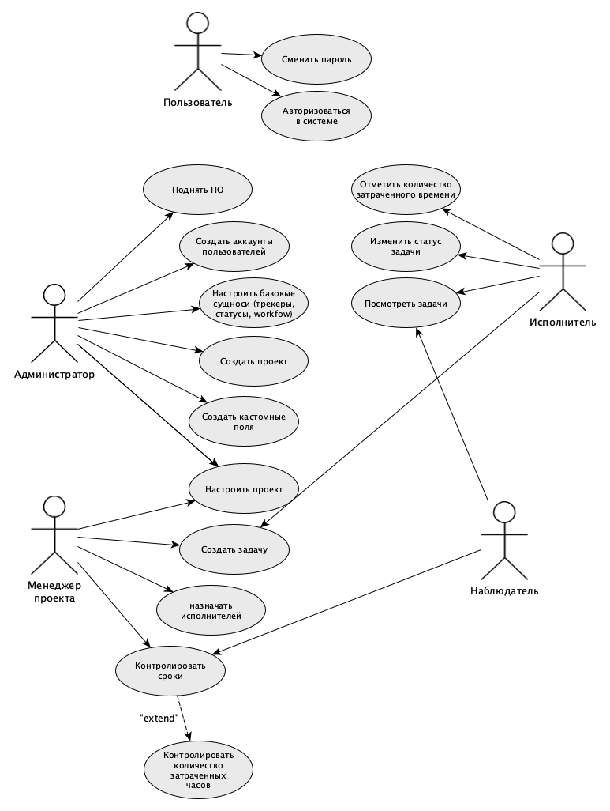
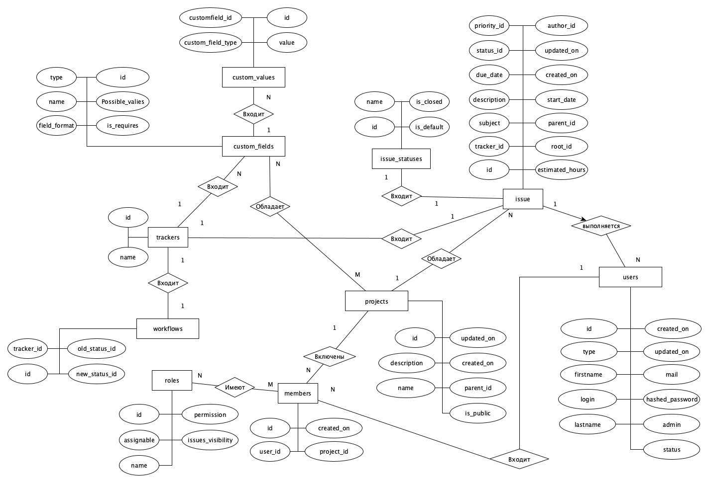
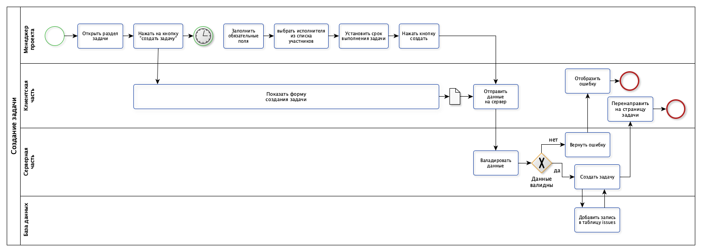
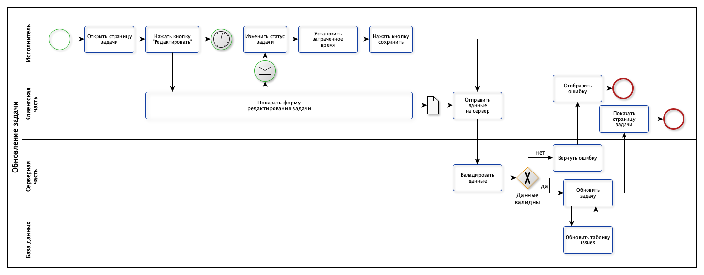
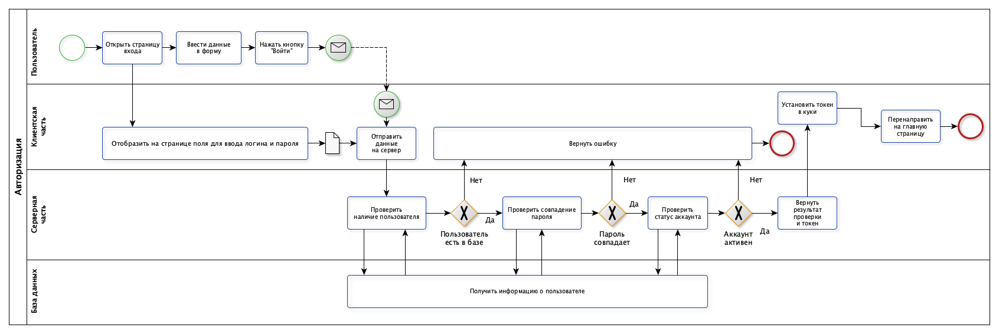

# Проект система управления версиями

## Краткое описание
Разрабатываемая система представляет собой сервис для координации работы команд, обеспечивающую централизованное планирование задач и контроль сроков исполнения. Проект, представляет собой аналог кафедрального сервиса redmine. Сервис предоставляет возможность создать проект, завести задачу, а также добавить системы для их трекинга. 

## Краткое описание предметной области
Предметная область охватывает процессы планирования, исполнения и мониторинга проектной деятельности в рамках организации. Основными сущностями области являются **Пользователь**, **Проект**, **Задача**, **Статус**. Взаимодействие сущностей строится вокруг жизненного цикла задачи, которая всегда принадлежит конкретному проекту и назначается на исполнителя.

## Анализ аналогичных решений

## Анализ аналогичных решений
Проведен сравнительный анализ существующих систем управления проектами (Trello, Jira, Redmine) с разрабатываемым решением по трем ключевым критериям: стоимость внедрения, порог входа для организации и гибкость настройки под специфические процессы.

**Таблица: Сравнительный анализ систем управления проектами**

| Критерий | Trello | Jira | Redmine | Разрабатываемая система | 
| :--- | :---: | :---: | :---: |  :---: |
| Стоимость внедрения | Низкая (SaaS) | Высокая (Лицензии) | Стоимость человекочасов на внедрение | Стоимость человекочасов на разработку |
| Порог входа | Низкий | Высокий | Средний | Средний |
| Гибкость настройки | Ограниченная | Высокая | Высокая | Высокая |

## Обоснование целесообразности и актуальности
Актуальность проекта обусловлена ростом удаленной занятости и потребностью малых команд в легких инструментах, не перегруженных функционалом корпоративных систем. Существующие массовые решения часто избыточны для специфических бизнес-процессов заказчика, что приводит к снижению производительности из-за сложности интерфейса.

## Акторы (роли)
В системе выделяются следующие основные роли пользователей:

- **Администратор**: управление пользователями, настройка системы, создание проектов.
- **Менеджер проекта**: создание задач, назначение исполнителей, контроль сроков, редактирование проектов.
- **Исполнитель**: изменение статуса задач, добавление задач.
- **Наблюдатель**: просмотр задач и прогресса без права редактирования.

## Use-Case

## ER-Диаграмма

## Пользовательские сценарии

### Создание и назначение задачи
**Актор:** Менеджер проекта (Project Manager)  
**Цель:** Создать новую задачу в системе и назначить ответственного исполнителя  
**Предусловия:**
- Менеджер авторизован в системе
- Менеджер имеет права на создание задач в проекте
- Проект существует и активен

1. Менеджер открывает раздел «Задачи» нужного проекта
2. Менеджер нажимает кнопку «Создать задачу» (New Issue)
3. Система отображает форму создания задачи со следующими полями:
   - Тема задачи (Subject)
   - Описание (Description)
   - Трекер (Tracker) — тип задачи (баг, фича, задача)
   - Статус (Status) — по умолчанию «Новая»
   - Приоритет (Priority)
   - Исполнитель (Assignee)
   - Категория (Category)
   - Срок выполнения (Due date)
4. Менеджер заполняет обязательные поля
5. Менеджер выбирает исполнителя из списка участников проекта
6. Менеджер устанавливает срок выполнения задачи
7. Менеджер нажимает кнопку «Создать»
8. Система валидирует данные формы
9. Система создает новую запись в таблице *issues*
10. Система перенаправляет на страницу созданной задачи

**Ошибки:**
- Если данные не прошли валидацию: система отображает ошибку

### Обновление статуса задачи и фиксация затраченного времени

**Актор:** Исполнитель
**Цель:** Обновить статус задачи и отметить затраченное время
**Предусловия:**
- Исполнитель авторизован в системе
- Исполнитель назначен или имеет права на редактирование
- Задача существует и находится в активном статусе

1. Исполнитель открывает страницу нужной задачи
2. Исполнитель нажимает кнопку «Редактировать»
3. Система отображает форму обновления задачи
4. Исполнитель изменяет статус задачи
5. Исполнитель вводит затраченное время в поле «Затраченное время»
6. Исполнитель нажимает кнопку «Сохранить»
7.  Система валидирует введенные данные
8.  Система обновляет запись в таблице *issues*
9.  Система перенаправляет на обновленную страницу задачи

**Ошибки:**
- Если статус не может быть изменен согласно workflow: система отображает ошибку, Исполнитель выбирает допустимый статус

### Авторизация и регистрация пользователей в системе

**Актор:** Зарегистрированный пользователь (Пользователь)  
**Цель:** Получить доступ к системе с использованием учетных данных  
**Предусловия:**
- Пользователь имеет активную учетную запись в системе
- Учетная запись не заблокирована администратором
- Пользователь находится на странице входа в систему

1. Пользователь открывает страницу входа в систему
2. Пользователь вводит свои учетные данные
3. Пользователь нажимает кнопку «Войти»
4. Система проверяет наличие пользователя в таблице *users* по логину или email
5. Система проверяет соответствие хеша пароля
6. Система проверяет статус учетной записи (`status = active`)
7. Система возвращает результат проверки, токен записывается в куки.
8. Система перенаправляет пользователя на главную страницу или на страницу, запрошенную до авторизации

**Ошибки:**
- Если пользователь не найден в базе: система отображает общее сообщение «Неверный логин или пароль»
- Если пароль не совпадает: система отображает сообщение «Неверный логин или пароль», счетчик неудачных попыток увеличивается
- Если количество неудачных попыток входа превысило лимит: система временно блокирует возможность входа для данного аккаунта
- Если учетная запись заблокирована, возвращается ошибка

## BPMN-нотация бизнес процессов
### Создание и назначение задачи

### Обновление статуса задачи и фиксация затраченного времени

### Авторизация и регистрация пользователей в системе

